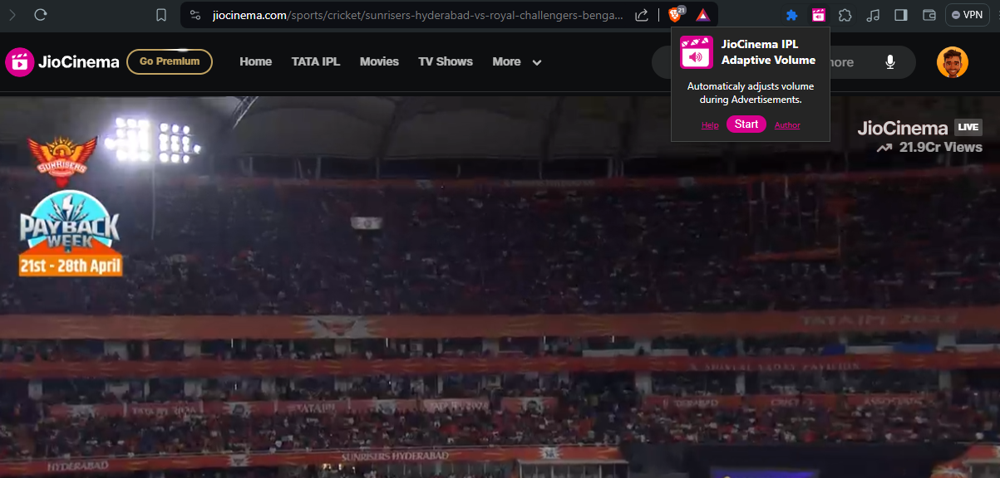

## JioCinema IPL Adaptive Volume

This Chrome extension automatically manages your volume during Indian Premier League (IPL) broadcasts on JioCinema.

### Features

* **Reduces volume during commercials:** No more jarring volume spikes during ad breaks!
* **Restores original volume after commercials:** Enjoy the match at your preferred volume seamlessly.

### Installation

1. **Download the extension:** Download ZIP of this repository.
2. **Extract ZIP:** Right Click and extract the ZIP
3. **Load the extension in Chrome:**
    * Open Chrome and navigate to  chrome://extensions.
    * Enable "Developer mode" by clicking the toggle switch in the top right corner.
    * Click "Load unpacked" and select the extracted folder containing the extension.
    

### Usage

The extension works automatically in the background while you watch IPL matches on JioCinema.
* Open the IPL Match on JioCinema
* Click on the JioCinema IPL Adaptive Volume extension, and click **Start**
  
* Click **Stop** to stop the extension.

**Note:** This extension relies on detecting ad breaks based on DOM elements. There might be occasional inconsistencies in detecting commercials, especially during transitions.

### Author

Snippetzz - Akshay Kumar Gola

[][linkedin]
[][youtube]
[][instagram]

[linkedin]: https://www.linkedin.com/in/akshay-kumar-gola/
[youtube]: https://www.youtube.com/@amsnippetzz
[instagram]: https://www.instagram.com/snippet.zz/